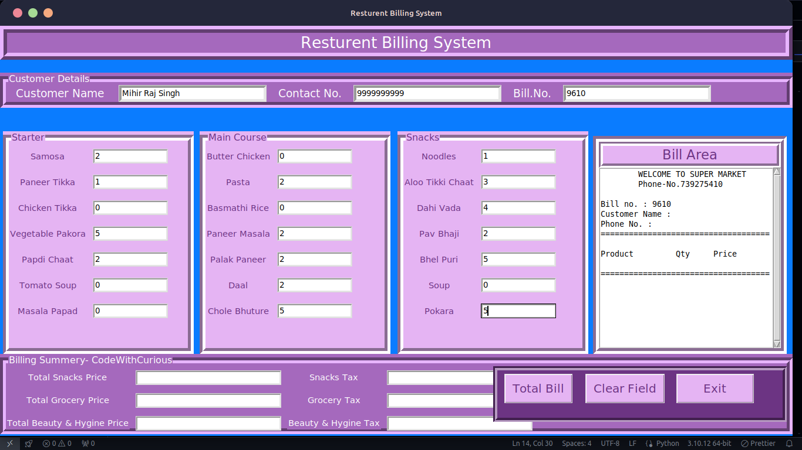

# Restaurant Billing System

This is a Python-based Restaurant Billing System GUI application using Tkinter. It allows users to manage restaurant orders, calculate bills, and maintain customer records.

## Table of Contents

- [Features](#features)
- [Images](#images)
- [Installation](#installation)
- [Usage](#usage)
- [Contributing](#contributing)
- [License](#license)

## Images




## Features

- **User-friendly Interface:** Simple and intuitive GUI designed using Tkinter.
- **Customer Management:** Add customer details including name, phone number, and generate unique bill numbers.
- **Menu Management:** Categorizes items into snacks, main course, and hygiene products.
- **Billing:** Calculates and displays total bills inclusive of taxes for each category of items.
- **Clear and Exit:** Options to clear fields or exit the application.

## Installation

To run this application locally, ensure you have Python and tkinter installed on your system. Clone the repository and install the necessary dependencies:

```bash
git clone https://github.com/iammihirsig/RestuarentBillingSystem
cd restaurant-billing-system
pip install tk
```

## Usage

1. Navigate to the project directory.
2. Run the application using Python:

```bash
python restaurant_billing_system.py
```

3. Enter customer details, select items from the menu, and calculate the bill.
4. Use the "Clear Field" button to reset inputs or "Exit" to close the application.

## Contributing

Contributions are welcome! Here's how you can contribute to this project:

1. Fork the repository.
2. Create a new branch (`git checkout -b feature/your-feature`).
3. Make modifications and commit changes (`git commit -am 'Add your feature'`).
4. Push to the branch (`git push origin feature/your-feature`).
5. Create a new Pull Request.

## License

This project is licensed under the MIT License - see the [LICENSE](LICENSE) file for details.
